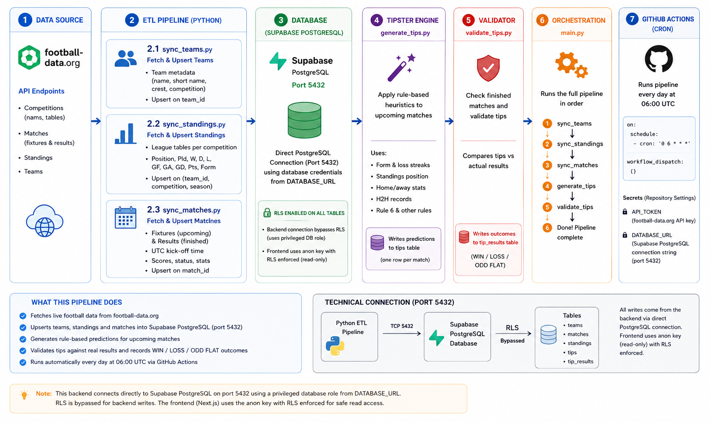

# ⚽ Football Tipster — Backend

> Python ETL pipeline that fetches live football data, generates rule-based predictions, validates outcomes, and writes everything to a Supabase PostgreSQL database. Runs automatically every day via GitHub Actions.

---

## Table of Contents

- [Overview](#overview)
- [Project Structure](#project-structure)
- [How It Works](#how-it-works)
- [Setup & Installation](#setup--installation)
- [Configuration](#configuration)
- [Running the Pipeline](#running-the-pipeline)
- [ETL Modules](#etl-modules)
- [Tipster Engine](#tipster-engine)
- [Database](#database)
- [GitHub Actions (Cron)](#github-actions-cron)
- [Dependencies](#dependencies)

---

## Architecture Diagram



---
## Overview

This backend is the data engine behind the Football Tipster dashboard. It:

1. Pulls match, standings, and team data from the [football-data.org](https://www.football-data.org/) API
2. Upserts everything into Supabase (PostgreSQL via the port 5432)
3. Runs a rule-based engine to generate match prediction tips
4. Validates tips against real match results and writes WIN / LOSS / ODD FLAT outcomes
5. Repeats daily at **06:00 UTC** via a GitHub Actions cron job

---

## Project Structure

```
football-tipster-backend/
│
├── config/
│   └── settings.py                  # env-var based config, season, competition codes
│
├── database/
│   ├── db.py                        # Supabase client (port 5432)
│   └── schema.sql                   # Full PostgreSQL schema + RLS policies
│
├── api/
│   └── football_api.py              # football-data.org API wrapper
│
├── etl/
│   ├── sync_matches.py              # Fetch & upsert fixtures/results
│   ├── sync_standings.py            # Fetch & upsert league tables
│   └── sync_teams.py                # Fetch & upsert team metadata
│
├── features/
│   └── form.py                      # last-7-match form computation
│
├── tipster/
│   ├── generate_tips.py             # Rule-based prediction engine → tips table
│   └── validate_tips.py             # Join tips vs results → tip_results table
│
├── main.py                          # Orchestrator: runs the full pipeline end-to-end
│
├── requirements.txt                 # Python dependencies
│
└── .github/
    └── workflows/
        └── etl.yml                  # GitHub Actions cron (daily 06:00 UTC)
```

---

## How It Works

```
football-data.org API
        │
        ▼
  ┌─────────────────────┐
  │   Python ETL        │
  │  sync_matches.py    │
  │  sync_standings.py  │
  │  sync_teams.py      │
  └────────┬────────────┘
           │  upsert
           ▼
  ┌─────────────────────┐
  │  Supabase           │
  │  (PostgreSQL)       │
  │  port 5432   │
  └────────┬────────────┘
           │
           ▼
  ┌─────────────────────┐
  │  Tipster Engine     │
  │  generate_tips.py   │──▶  tips table
  └────────┬────────────┘
           │
           ▼
  ┌─────────────────────┐
  │  Validator          │
  │  validate_tips.py   │──▶  tip_results table
  └─────────────────────┘
```

---

## Setup & Installation

### Tech Stack

| Layer | Technology |
|-------|------------|
| Language | Python 3.11 |
| Database | PostgreSQL via Supabase |
| Scheduling | GitHub Actions (cron) |
| Data source | [football-data.org](https://www.football-data.org/) API |

### Install dependencies

```bash
git clone https://github.com/mulongocheloti/football_tipster.git
cd football-tipster-backend

python -m venv venv
source venv/bin/activate        # Windows: venv\Scripts\activate

pip install -r requirements.txt
```

---

## Configuration

Create a `.env` file in the project root (never commit this):

```env
API_TOKEN=your_football_data_org_api_key
DATABASE_URL=your_supabase_connection_string_port_5432
```

`config/settings.py` reads these variables and also holds the current season and list of competition codes the pipeline tracks.

| Code | League |
|------|--------|
| PL | Premier League (England) |
| CL | Champions League (Europe) |
| BL1 | Bundesliga (Germany) |
| PD | La Liga (Spain) |
| SA | Serie A (Italy) |
| FL1 | Ligue 1 (France) |
| DED | Eredivisie (Netherlands) |
| PPL | Primeira Liga (Portugal) |
| ELC | Championship (England) |

> **Note:** `DATABASE_URL` points to Supabase on port 5432. The backend connects with the service role so it can write past RLS. The frontend uses the anon key with RLS enforced.

---

## Running the Pipeline

Run the full pipeline manually:

```bash
python main.py
```

`main.py` orchestrates the steps in this order:

1. `sync_teams` — ensures team metadata is up to date
2. `sync_standings` — refreshes league table positions
3. `sync_matches` — upserts fixtures and results for configured competitions
4. `generate_tips` — applies prediction rules to upcoming matches
5. `validate_tips` — checks finished matches and updates tip outcomes

You can also run individual modules:

```bash
python -m etl.sync_matches
python -m etl.sync_standings
python -m tipster.generate_tips
python -m tipster.validate_tips
```

---

## ETL Modules

### `etl/sync_matches.py`

Fetches upcoming and recently finished matches for all configured competitions. Uses an **upsert** (`on_conflict: match_id`) so re-runs are safe and idempotent. Stores UTC kick-off times; the frontend converts to EAT (UTC+3).

### `etl/sync_standings.py`

Fetches current league table standings per competition. Updates team position, points, goal difference, form, and wins/draws/losses.

### `etl/sync_teams.py`

Fetches and upserts team metadata (name, short name, crest URL, competition). Run when new teams need to be seeded.

---

## Tipster Engine

### `tipster/generate_tips.py`

Applies a set of rule-based heuristics to upcoming matches to produce predictions. Each tip is written to the `tips` table with:

| Field | Description |
|---|---|
| `match_id` | FK to matches table |
| `prediction` | e.g. `1X`, `X2`, `1-DNB`, `2-DNB` |
| `confidence` | Score from 0–5 |
| `flag` | Optional warning label (e.g. `Rule 6`) |

Rules are built on features such as: recent form strings, home/away performance, standings position, head-to-head records, and loss streaks.

| Rule | Description |
|------|-------------|
| **Rule 1** | Points difference between teams must be ≥ 10 |
| **Rule 2** | Clear favourite identified by league position (top 7 home or top 4 away) |
| **Rule 3** | Favourite must have ≥ 4 days rest since last match |
| **Rule 4** | Favourite must have no important match (CL, Cup) within 3 days |
| **Rule 5** | Favourite must not have 3+ losses in their last 7 matches |
| **Rule 6** | Flag(s) - blacklisted/not rested/important match upcoming |

| Prediction | Meaning | Condition |
|------------|---------|-----------|
| `1-DNB` | Back home team, Draw No Bet | Home favourite, rested, no important match |
| `2-DNB` | Back away team, Draw No Bet | Away favourite, rested, no important match |
| `1X` | Home win or Draw | Home favourite, not fully rested |
| `X2` | Draw or Away win | Away favourite, not fully rested |

### `tipster/validate_tips.py`

After matches finish, joins the `tips` table against actual results and writes each outcome (`WIN`, `LOSS`, or `ODD FLAT`) to the `tip_results` table. Only processes matches with a final score that don't already have a validated result.

---

## Database Schema

The full schema lives in `database/schema.sql`. Key tables:

| Table | Purpose |
|---|---|
| `teams` | Team metadata (id, name, competition) |
| `matches` | Fixtures and results (scores, status, UTC date) |
| `standings` | League table rows per competition per season |
| `tips` | Generated predictions |
| `tip_results` | Validated tip outcomes (WIN / LOSS / ODD FLAT) |
| `team_blacklist` | Teams with poor form / inconsistent |
| `api_sync_log` | Tracks last sync per competition to avoid redundant calls |

**Row Level Security (RLS)** is enabled on all tables. The frontend anon key has `SELECT` access only. All writes go through the service role key (backend only).

Connection is made via Supabase on **port 5432** to keep connections efficient in the serverless/cron context.

---

## GitHub Actions (Cron)

`.github/workflows/etl.yml` runs `python main.py` every day at **06:00 UTC**.

```yaml
on:
  schedule:
    - cron: '0 6 * * *'
  workflow_dispatch:        # also allows manual runs from the Actions tab
```

Secrets required in the repository's **Settings → Secrets and variables → Actions**:

| Secret | Value |
|---|---|
| `API_TOKEN` | Your football-data.org API key |
| `DATABASE_URL` | Your Supabase connection string (port 5432) |

---

## Dependencies

```
supabase
requests
python-dotenv
```

Full pinned versions in `requirements.txt`.

---

## Related

- **Frontend repo:** [`football-tipster-frontend`](https://github.com/mulongocheloti/football-tipster-frontend) — Next.js 14 dashboard deployed on Vercel
- **Data source:** [football-data.org](https://www.football-data.org/)
- **Database:** [Supabase](https://supabase.com/)
